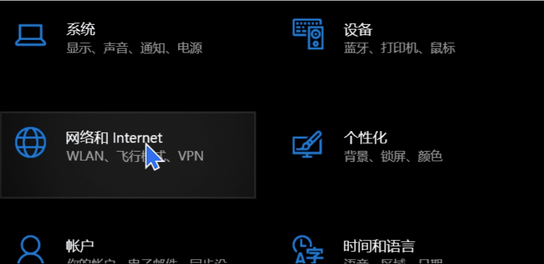
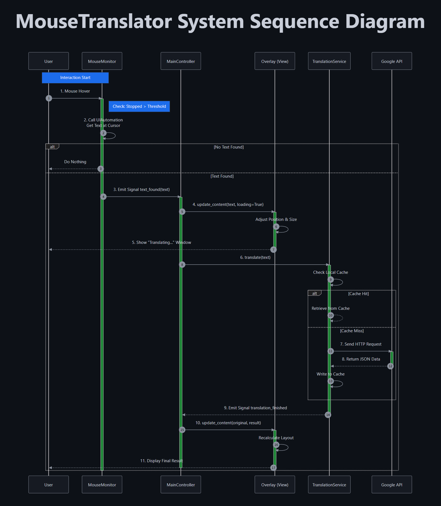
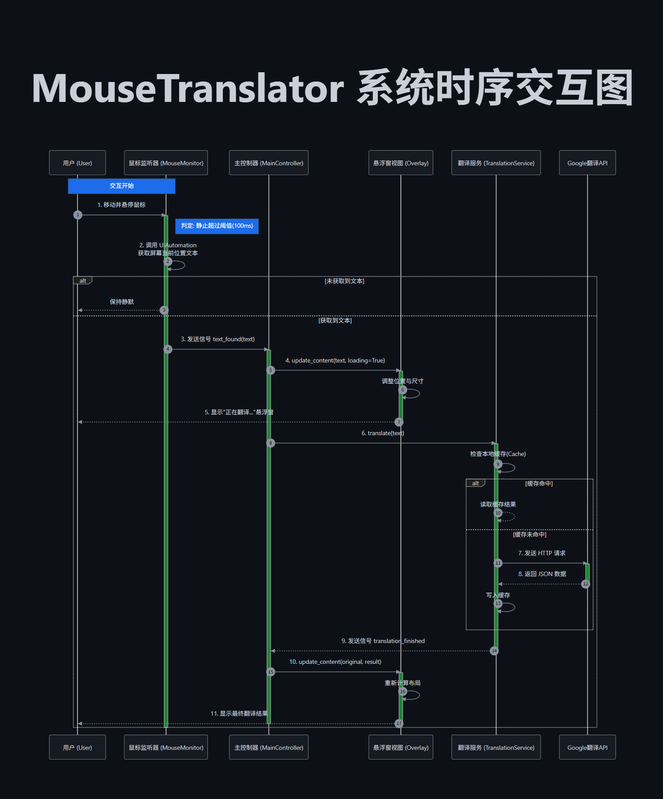

# MouseTranslator (Basic Edition)


> **[English](#english-version) | [简体中文](#chinese-version)**

---

<a name="english-version"></a>
## 🖱️ MouseTranslator (Basic Edition)

> "The 'Best' Ultra-lightweight Translation Assistant on Windows — Minimalist, Pure, and Efficient."

**MouseTranslator (Basic Edition)** is an **Open Source** **Screen Translator** designed for Windows. Built with **Windows UIAutomation**, it offers a "Handle-based Text Picking" experience that is faster and lighter than OCR solutions. 

Key Features: **Real-time Translator**, **Mouse Hover Translation**, zero dependencies, and **Productivity Tool** focused.

### ✨ Demo

<div align="center">
  
</div>

*“Hover to translate, move to vanish. A native experience based on UIAutomation.”*

### ⚖️ The Choice

For most users, the **Basic Edition** is perfect. However, if you need to translate text from PDFs, games, or images, the **Professional Edition** is your ultimate productivity tool.

| Feature | 🌱 Basic Edition (Open Source) | 🔥 Professional Edition |
| :--- | :---: | :---: |
| **Technology** | **UIAutomation (Handle)** | **UIAutomation + OCR + Screenshot (Tri-Core)** |
| **Scenarios** | Text Controls, Standard Apps | **Images, PDF, Games, Unselectable Text** |
| **Engine** | Google (Stable Single Source) | **Google / Baidu (Auto Failover)** |
| **Languages** | Basic (En/Zh) | **All Languages (JP/KR/SEA, etc.)** |
| **Advanced** | None | **Hardware Lock, History, Concurrency** |
| **Get It** | [⏬ Download](#-quick-start) | [🚀 Contact](#-license--contact) |

### ⚡ Quick Start

#### Requirements
- Windows 10 / 11
- Python 3.8+

#### Install & Run

```bash
# 1. Clone Repo
git clone https://github.com/YourRepo/MouseTranslator.git
cd MouseTranslator/BasicVersion

# 2. Install Minimal Dependencies
pip install -r requirements.txt

# 3. Run
python main.py
```

<div align="center">
  
</div>

### 📜 License & Contact

**License**: MIT  
**Contact**: For **Professional Edition** inquiries (OCR, Multi-engine support), please contact:
- 📧 Email: zhu.siyuan@163.com

---

<a name="chinese-version"></a>
## 🖱️ MouseTranslator (青春版)

> "Windows 上最『懂』你的极致轻量翻译助手 —— 拒绝臃肿，回归阅读本质。"

**MouseTranslator 青春版** 是一款基于 **Windows UIAutomation** 的 **开源翻译软件**。它专为追求极致效率的开发者设计，主打 **屏幕取词** 和 **实时翻译**。

核心关键词：**翻译助手**、**Windows 效率工具**、**程序员取词**、**轻量级**。

### ✨ 演示 | Demo

<div align="center">
  
</div>

*“鼠标悬停即译，移开即逝。基于 UIAutomation 的原生级体验。”*

### ⚖️ 你的选择 | The Choice

绝大多数时候，**青春版 (Basic)** 已经完全足够。但如果你需要处理 PDF、游戏或设计图中的文字，**专业版 (Pro)** 将是你的终极生产力工具。

| 功能特性 | 🌱 青春版 (Open Source) | 🔥 专业版 (Professional) |
| :--- | :---: | :---: |
| **取词技术** | 微软 UIAutomation (句柄) | **UIAutomation + OCR + 截图 (三核)** |
| **适用场景** | 文本控件、标准软件 | **图片、PDF、游戏、无法选中的文字** |
| **翻译引擎** | Google (稳定单源) | **Google / Baidu (自动灾备切换)** |
| **语种支持** | 基础 (英/中) | **全语种 (含日/韩/东南亚小语种)** |
| **高级功能** | 无 | **一机一码硬件锁、历史记录、企业级并发** |
| **获取方式** | [⏬ 立即下载](#-快速开始--quick-start) | [🚀 联系作者获取](#-协议与联系--license--contact) |

### ⚡ 快速开始 | Quick Start

#### 环境要求
- Windows 10 / 11
- Python 3.8+

#### 安装与运行

```bash
# 1. 克隆仓库
git clone https://github.com/YourRepo/MouseTranslator.git
cd MouseTranslator/BasicVersion

# 2. 安装极简依赖
pip install -r requirements.txt

# 3. 启动程序
python main.py
```

<div align="center">
  
</div>

- **Input Layer**: `mouse_monitor.py` - 负责监听鼠标轨迹与静止事件。
- **Controller**: `main_controller.py` - 中央调度器，协调各层通讯。
- **Service Layer**: `translation_service.py` - 封装翻译 API，处理网络请求。
- **View Layer**: `overlay.py` - 无边框、鼠标穿透的悬浮窗绘制。

### 📜 协议与联系 | License & Contact

**License**: MIT  
**Contact**: 如果你需要 **专业版 (Professional)** 的高级功能（OCR、多引擎、截图翻译），请通过以下方式联系授权：
- 📧 Email: zhu.siyuan@163.com

---

<div align="center">
  <p>If you like this project, please give it a ⭐ <b>Star</b>!<br>如果你喜欢这个项目，请点亮 ⭐ <b>Star</b> 支持一下！</p>
</div>
